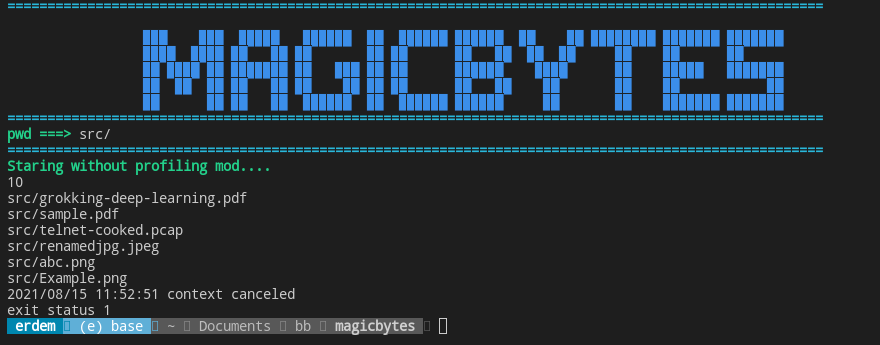

# What is Magicbytes ?
File signatures, data used to identify or verify the content of a file. Such signatures are also known as magic numbers or Magic Bytes.Basiclly Magic byte is nothing but the first few bytes of a file which is used to recognize a file.

# Magicbytes Golang Program
This is go package for finding  files recursively in a target directory with the following API for given file meta information.

```go
// Meta holds the name, magical bytes, and offset of the magical bytes to be searched.
type Meta struct {
 Type string // name of the file/meta type.
 Bytes []byte // magical bytes.
 Offset int64 // offset of the magical bytes from the file start position.
}
// OnMatchFunc represents a function to be called when Search function finds a match.
// Returning false must immediately stop Search process.
type OnMatchFunc func(path, metaType string) bool
// Search searches the given target directory to find files recursively using meta information.
// For every match, onMatch callback is called concurrently.
Search(ctx context.Context, targetDir string, metas []*Meta, onMatch OnMatchFunc) error

```
# magicbytes



for running and building code:
```bash
go run main.go
```
```bash
go build main.go && ./main
```

For profiling mod please set healthCheck to true

```go
healthCheck := true

```
Docker file for docker building
```dockerfile
FROM golang

WORKDIR $GOPATH/src/github.com/ErdemOzgen/magicbytes/magicbytes

COPY . .

RUN go get -d -v ./...
RUN go install -v ./...
RUN go build -o .

EXPOSE 6060

CMD ["bin-magicbytes"]
```
